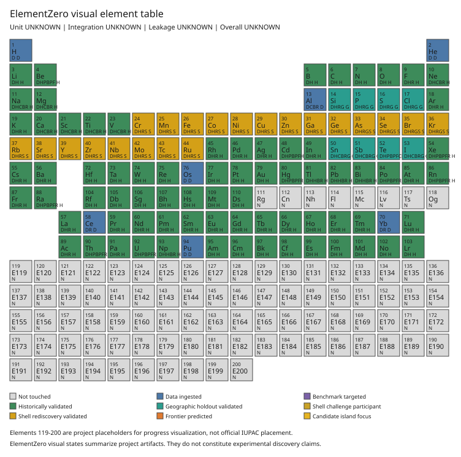

# ElementZero

ElementZero is nuclear-mass research for the superheavy / hyperheavy landscape.
It consumes [Sovrance/Atlas](https://github.com/Sovrance/Atlas) PIR as a
commit-pinned evidence kernel and does not copy Atlas source.

v0.2 implements **EZ-B001 — Historical Nuclear Mass Prediction** (legacy alias
`ZME-B001`) with a no-leakage prepare / freeze / predict / finalize / score
protocol.

## Install

```bash
python -m pip install --upgrade pip
python tools/ensure_atlas_pir.py
python -m pip install -e '.[dev]'
```

`tools/ensure_atlas_pir.py` clones the immutable SHA in `atlas.lock.json`.
Atlas at the reviewed baseline is not yet an installable package; the tool
writes the recommended `sovrance-atlas-pir` packaging overlay into the clone
only. Required `pip install -e '.[dev]'` dependencies do not fetch that raw
git SHA (the Atlas pin lives under the optional `[atlas]` extra). Do not copy
`pir/` into this repository. Do not depend on Atlas `main`.

## EZ-B001

```bash
elementzero benchmark prepare-targets --benchmark EZ-B001 --later-source later.mas --edition AME2020 --known-source old.mas --known-edition AME2003 --output targets.json
elementzero benchmark freeze --benchmark EZ-B001 --training-source old.mas --edition AME2003 --targets targets.json --output freeze.json
elementzero benchmark predict --benchmark EZ-B001 --freeze freeze.json --targets targets.json --training-source old.mas --out run/prediction/
elementzero benchmark finalize --run run/prediction/
elementzero benchmark score --run run/prediction/ --truth-source later.mas --out run/scoring/
```

### Three-model suite

The frozen suite is the ordered set `EZ-SEMF-LS-v1`, `EZ-GP-DIRECT-v1`,
`EZ-SEMF-GP-RESIDUAL-v1`. Every model shares one KnowledgeFreeze, one target
set, one feature policy, and one set of source hashes, and each gets its own
sealed run directory.

```bash
elementzero benchmark suite-predict --freeze freeze.json --targets targets.json --training-source old.mas --out run/EZ-B001-A/
elementzero benchmark suite-score --suite run/EZ-B001-A/ --truth-source later.mas
```

`suite-score` writes `model_comparison.json` and `model_comparison.md`. No model
is labelled "best"; the report emits every metric for every model and states its
(empty) ranking rule explicitly.

### Scored metrics (v0.3)

```text
error_i = prediction_i - truth_i

MAE_keV   = mean(abs(error_i))
MedAE_keV = median(abs(error_i))
RMSE_keV  = sqrt(mean(error_i^2))

NLPD_i    = 0.5*log(2*pi*sigma_i^2) + 0.5*((truth_i - prediction_i)/sigma_i)^2
NLPD      = mean(NLPD_i)

coverage_90  = count(truth_i inside interval_90_i) / n
coverage_95  = count(truth_i inside interval_95_i) / n
cal_error_90 = abs(coverage_90 - 0.90)
cal_error_95 = abs(coverage_95 - 0.95)

d_L1 = abs(Z_target - Z_train) + abs(N_target - N_train)
nearest_training_L1 = min over training nuclei
I    = (N - Z) / A
```

sigma_i is the model's own predictive standard deviation, persisted in
`predictions.json` and in every prediction certificate. It is never
reconstructed from truth or from rounded intervals. Results are grouped into the
preregistered distance buckets `d=1`, `d=2`, `d=3-4`, `d>=5` and Z bands
`light` (Z<20), `medium` (20<=Z<50), `heavy` (50<=Z<82), `very_heavy` (Z>=82);
an empty group is reported with `n = 0` rather than dropped.

### Evidence graph

Each prediction run persists the Atlas lineage under `<run>/atlas/`:

```text
raw artifact -> training dataset -> knowledge freeze -> model fit
             -> prediction (one per target) -> prediction set -> finalization
                                                             -> validation (scoring)
```

`predict` writes `artifacts.json`, `events.json`, `facts.json`,
`provenance.json`; `finalize` adds `finalization_facts.json` /
`finalization_provenance.json`; `score` writes `scoring_facts.json` /
`scoring_provenance.json` beside the metrics. Bundles use Atlas canonical JSON,
so a rehydrated fact re-derives the Atlas content ID it was stored under.

## EZ-B002 — Geographic Nuclear-Chart Holdout

EZ-B001 asks whether the suite could predict later historical knowledge. EZ-B002
asks whether it can reconstruct a region of the *known* chart when every truth
value inside that region is withheld. Targets are the eligible nuclei inside a
preregistered region of the (Z, N) lattice; training is everything outside it.

```bash
elementzero benchmark b002-select-regions --source snapshot.mas --edition AME2020 --output regions.json --candidates-output region_candidates.json
elementzero benchmark b002-seal-experiment --source snapshot.mas --edition AME2020 --regions regions.json --dir experiments/EZ-B002-v1/
elementzero benchmark b002-score-experiment --source snapshot.mas --edition AME2020 --dir experiments/EZ-B002-v1/
```

The single-region stages `b002-prepare`, `b002-freeze`, `b002-predict`,
`b002-finalize`, and `b002-score` mirror the EZ-B001 five-process flow.

Regions are generated, never hand-picked: fixed-size `z_span x n_span` windows
anchored at every eligible nucleus, filtered by minimum targets and by training
support on at least two faces, then ordered by `(Z band, -n_targets, region_id)`
— source counts and identities only, never a metric. `region_manifest_hash`
enters the KnowledgeFreeze, the ModelFitFact, and every certificate.

Extrapolation depth is `nearest_training_L1`, and metrics are reported by exact
depth, by region, and by model, with the worst region named. EZ-B002 v1 declares
no accuracy pass/fail threshold: it is characterization. Details in
`docs/benchmarks/ez-b002.md`.

## EZ-B003 — Hidden Shell Rediscovery Challenge

EZ-B002 hides a rectangle. EZ-B003 hides the neighborhood of a *known shell
closure* — `N in {N0-1, N0, N0+1}` or `Z in {Z0-1, Z0, Z0+1}` — and asks whether
the reconstructed mass surface still shows the shell-gap structure that is
actually there.

```bash
elementzero benchmark b003-select-challenges --source snapshot.mas --edition AME2020 --output challenges.json
elementzero benchmark b003-seal-experiment --source snapshot.mas --edition AME2020 --challenges challenges.json --dir experiments/EZ-B003-v1/ --scope synthetic
elementzero benchmark b003-score-experiment --source snapshot.mas --edition AME2020 --dir experiments/EZ-B003-v1/
```

The single-closure stages `b003-prepare`, `b003-freeze`, `b003-predict`,
`b003-finalize`, and `b003-score` mirror the same five-process flow.

Masses are turned into `S2n`/`S2p` and then into the shell-gap indicators
`delta2n`/`delta2p`, and the withheld closure is ranked inside a preregistered,
parity-matched search window. Every derived value is marked `derived` and is never
counted as independent evidence. A `discovery` feature profile is firewalled
against magic-number and shell-distance features, and it is never pooled with an
`accuracy` profile. Closures the support rule cannot carry are reported
`NOT_EVALUABLE` with reasons rather than dropped.

Unlike EZ-B002, EZ-B003 has a preregistered rediscovery criterion. Its thresholds
were calibrated on synthetic mechanics only and are frozen, hashed, by the seal
phase before any closure truth is read.

```text
EZ-B003 measures rediscovery of KNOWN shell structure under controlled masking.
A met criterion is NOT proof of a new magic number, and NOT evidence that a
predicted Z = 154 shell gap or an island of stability exists.
```

On the committed synthetic chart all three baselines come out
`CRITERION_NOT_MET`. The residual model recovers the sign of the gap in every
scored chain and puts the closure in the top 3 in 80% of them, then ranks it
first in 8.6% — it detects a discontinuity without localizing it, which is what
a smooth interpolator does to a kink. The thresholds stay where they were frozen.

No closure of an evaluated mass table has been scored yet. Details in
`docs/benchmarks/ez-b003.md`.

## Visual element table

The progress table is generated from tests and benchmark artifacts, not hand-edited tiles.
`elementzero visual build` replaces the snapshot below whenever the derived values change.

```bash
elementzero visual build --input-root . --layout extended_200_project_v1 --output-root reports/visuals/
```

Outputs: `element_progress_events.jsonl`, `element_table_state.json`, `element_table.html`, `element_table.svg`, `visual_render_bundle.json`.

<!-- ELEMENTZERO_VISUAL_TABLE_BEGIN -->


| Check | Status |
| --- | --- |
| Unit | UNKNOWN |
| Integration | UNKNOWN |
| Leakage | UNKNOWN |
| Overall | UNKNOWN |
| Benchmark | UNKNOWN |

| Primary stage | Elements |
| --- | --- |
| Not touched | 200 |
| Data ingested | 0 |
| Benchmark targeted | 0 |
| Historically validated | 0 |
| Geographic holdout validated | 0 |
| Shell challenge participant | 0 |
| Shell rediscovery validated | 0 |
| Frontier predicted | 0 |
| Candidate island focus | 0 |

| Field | Value |
| --- | --- |
| Layout | `extended_200_project_v1` |
| Events | 0 |
| Generator | `visual-table-v0.1` |
| State hash | `4b00cf68604c0e66` |
| SVG hash | `f655cf24abc8e697` |

Elements 119-200 are project placeholders, not official IUPAC placement. Prediction-only runs are never shown as validated. Visual states summarize project artifacts and do not constitute experimental discovery claims.
<!-- ELEMENTZERO_VISUAL_TABLE_END -->

## Architecture rule

```text
Atlas owns generic scientific evidence infrastructure.
ElementZero consumes Atlas through a pinned dependency and a thin adapter.
ElementZero MUST NOT copy, fork, or silently modify Atlas PIR source.
```

## Research baseline and work orders

- Canonical research basis: `docs/research/ElementZero_Initial_Research_Baseline_v0.1.md`
- Engineering work orders: `docs/work_orders/v0.3/` (start at `00_MASTER_EXECUTION_ORDER.md`)
- Agent handoff docs / task graph: `docs/00_EXECUTIVE_HANDOFF.md`, `agents/task_manifest.json`
- Superseded ZME/PEC engineering docs: `docs/legacy/` (non-normative)
- Legacy scaffolds under `scaffold/` remain for `python scripts/validate_bundle.py` smoke only
